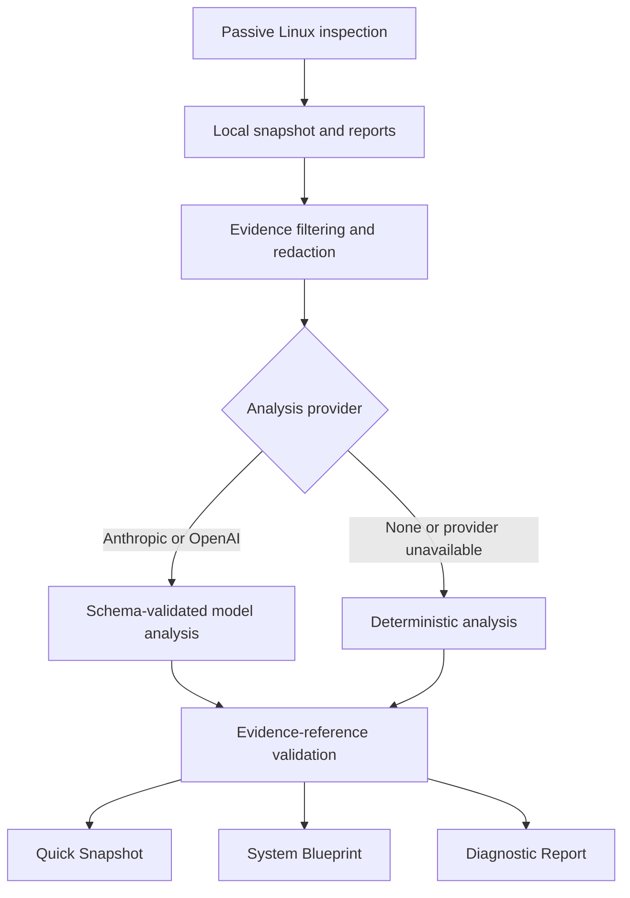

# Screwdriver

[](RELEASE_NOTES.md)
[](https://github.com/phoenix1revv-risefromashes/screwdriver/actions/workflows/ci.yml)
[](https://www.python.org/)
[](LICENSE)
- [Screwdriver v1.0.0 release notes](docs/releases/v1.0.0.md)
<!-- markdownlint-disable MD013 -->

## Agentic or Local Robotics Diagnostics: See the entire system—and what’s wrong with it—in under 30 seconds.

Inspecting a robotic system manually is long, fragmented, and error-prone. Engineers move between hardware tools, device paths, permissions, network settings, processes, containers, ROS 2 interfaces, and software configurations—often spending hours troubleshooting while an obvious fault or misconfiguration remains overlooked.

This is where Screwdriver comes in.

In under 30 seconds, Screwdriver inspects the entire robotic system [or the specific isolated part using --focus flag] and turns the collected evidence into clear engineering reports. It maps the system from physical hardware to complete robot capabilities, immediately identifying faults, broken connections, missing components, configuration problems, and the exact layer where a capability fails. Along the way, it handles most of the discovery and fault-isolation work involved in robotic system bring-up.

Run it locally for fast and free-of-cost, deterministic diagnostics, or use OpenAI or Anthropic for deeper agentic analysis. Screwdriver correlates evidence across every system layer to produce more detailed insights, likely root causes, diagnostic commands, and step-by-step fixes—all presented through an immediate system snapshot, a complete bottom-to-top blueprint, and an organized engineering diagnostic report.

## What Screwdriver produces

| Report | Purpose | Information flow |
|---|---|---|
| Local report | Complete deterministic inspection without a model | Host → hardware → Linux → networking → devices → ROS → software stacks |
| Quick System Snapshot | One-page operational view | Compute → physical hardware → Linux integration → ROS 2 → capabilities → immediate problems |
| Complete System Blueprint | Bottom-to-top technical specification | Platform → buses → devices → drivers → paths → processes/containers → ROS → stacks → capabilities |
| Engineering Diagnostic Report | Problem-centered investigation and recovery guide | Priority → evidence → impact → causes → commands → solution → verification → rollback |
| Structured analysis JSON | Machine-readable analysis and provenance | Provider metadata → findings → confidence → probes → evidence references |

The Blueprint always presents a status matrix for 20 robotics stacks. It keeps
**installed**, **configured**, **running**, **connected**, and **integrated** separate.
Software presence alone is never treated as proof that a robot capability works.

## How it works



## Getting started

### Requirements

- Linux robotics computer or Linux development host
- Git and `curl`
- Internet access for initial setup
- Anthropic or OpenAI API key only for remote model-assisted analysis

### 1. Install Screwdriver

```bash
git clone https://github.com/phoenix1revv-risefromashes/screwdriver.git
cd screwdriver
chmod +x scripts/bootstrap.sh
./scripts/bootstrap.sh
```

The bootstrap script installs the pinned `uv` and Python versions locally, validates
`uv.lock`, creates `.venv`, and installs the locked dependencies.

### 2. Export one provider API key

The default provider is Anthropic:

```bash
export ANTHROPIC_API_KEY="your-anthropic-api-key"
```

To use OpenAI instead:

```bash
export OPENAI_API_KEY="your-openai-api-key"
```

Keys are read from the environment and are not written to snapshots or reports.

### 3. Verify the installation and selected key

For Anthropic:

```bash
test -n "$ANTHROPIC_API_KEY" && echo "Anthropic key is set"
.tools/bin/uv run --locked screwdriver --help
```

For OpenAI:

```bash
test -n "$OPENAI_API_KEY" && echo "OpenAI key is set"
.tools/bin/uv run --locked screwdriver --help
```

### 4. Run the first complete inspection

Default Anthropic analysis:

```bash
.tools/bin/uv run --locked screwdriver inspect --agentic
```

Explicit OpenAI analysis:

```bash
.tools/bin/uv run --locked screwdriver inspect --agentic \
  --provider openai \
  --model gpt-5.6-terra \
  --effort medium
```

The default agentic command uses `claude-sonnet-5` with `medium` Screwdriver effort.

### 5. Open the generated reports

```bash
xdg-open reports/agentic/latest/compact_snapshot.html
xdg-open reports/agentic/latest/system-blueprint.html
xdg-open reports/agentic/latest/diagnostic-report.html
```

The underlying deterministic report is available at:

```text
reports/local/latest/report.html
```

### 6. Re-analyze the saved snapshot later

```bash
.tools/bin/uv run --locked screwdriver analyze \
  reports/local/latest/snapshot.json
```

This creates a new analysis without collecting the machine again.

### No-key alternatives

Generate the full report suite using deterministic analysis:

```bash
.tools/bin/uv run --locked screwdriver inspect --agentic --provider none
```

Generate only the local deterministic inspection:

```bash
.tools/bin/uv run --locked screwdriver inspect --local
```

To use the virtual environment directly:

```bash
source .venv/bin/activate
screwdriver --help
```

Activation must be sourced. Do not execute `.venv/bin/activate` directly.

## Providers, models, and effort

Screwdriver v1 uses the Anthropic Messages API or OpenAI Responses API with strict
JSON-schema output.

Support labels in the tables mean:

- **Default; adapter-tested** — the model ID is the code default and its adapter payload,
  parsing, validation, fallback, and report pipeline are covered by automated tests.
- **API-compatible** — the provider documents the required endpoint and structured-output
  capability. These models are selectable but are not all called against live APIs in CI.
- **Limited access** — compatibility exists, but provider/account approval may be required.

Model availability can change by provider account, API tier, and region.

### Anthropic

| Model ID | Screwdriver effort behavior | Support status |
|---|---|---|
| `claude-sonnet-5` | `light`, `medium`, `high` | **Default; adapter-tested** |
| `claude-fable-5` | `light`, `medium`, `high` | API-compatible |
| `claude-mythos-5` | `light`, `medium`, `high` | API-compatible; limited access |
| `claude-mythos-preview` | `light`, `medium`, `high` | API-compatible; limited access |
| `claude-opus-5` | `light`, `medium`, `high` | API-compatible |
| `claude-opus-4-8` | `light`, `medium`, `high` | API-compatible |
| `claude-opus-4-7` | `light`, `medium`, `high` | API-compatible |
| `claude-opus-4-6` | `light`, `medium`, `high` | API-compatible |
| `claude-opus-4-5-20251101` | `light`, `medium`, `high` | API-compatible |
| `claude-sonnet-4-6` | `light`, `medium`, `high` | API-compatible |
| `claude-sonnet-4-5-20250929` | Model default after effort fallback | API-compatible |
| `claude-haiku-4-5-20251001` | Model default after effort fallback | API-compatible |

- Default: `claude-sonnet-5`
- Environment variable: `ANTHROPIC_API_KEY`
- API: Anthropic Messages API
- Official references: [model overview](https://platform.claude.com/docs/en/about-claude/models/overview), [structured outputs](https://platform.claude.com/docs/en/build-with-claude/structured-outputs), and [effort](https://platform.claude.com/docs/en/build-with-claude/effort)

### OpenAI

| Model ID | Screwdriver effort behavior | Support status |
|---|---|---|
| `gpt-5.6-terra` | `light`, `medium`, `high` | **Default; adapter-tested** |
| `gpt-5.6-sol` | `light`, `medium`, `high` | API-compatible |
| `gpt-5.6` | `light`, `medium`, `high` | API-compatible alias for `gpt-5.6-sol` |
| `gpt-5.6-luna` | `light`, `medium`, `high` | API-compatible |
| `gpt-5.5` | `light`, `medium`, `high` | API-compatible |
| `gpt-5.5-pro` | `medium`, `high`; `light` falls back to model default | API-compatible with timeout caution |
| `gpt-5.4` | `light`, `medium`, `high` | API-compatible |
| `gpt-5.4-mini` | `light`, `medium`, `high` | API-compatible |
| `gpt-5.4-nano` | `light`, `medium`, `high` | API-compatible |

- Default: `gpt-5.6-terra`
- Environment variable: `OPENAI_API_KEY`
- API: OpenAI Responses API
- Official references: [model catalog](https://developers.openai.com/api/docs/models) and [GPT-5.6 Terra](https://developers.openai.com/api/docs/models/gpt-5.6-terra)

`gpt-5.4-pro` is incompatible with Screwdriver v1 because it does not support the
required structured output. Realtime, audio, image-generation, transcription,
embedding, moderation, and other non-text-analysis models are outside the adapter
contract.

`gpt-5.5-pro` may take several minutes and can exceed Screwdriver v1's 120-second
provider timeout on difficult snapshots.

### Effort mapping

Screwdriver deliberately exposes three portable effort levels, even when a provider
offers additional values:

| CLI value | Provider API value | Intended use |
|---|---|---|
| `light` | `low` | Faster, lower-cost analysis of straightforward evidence |
| `medium` | `medium` | Balanced complete-system analysis; **default** |
| `high` | `high` | Deeper correlation for complex bring-up and diagnostics |

If a compatible model rejects the explicit effort field, Screwdriver retries once
without it and records that the model's native default was used.

### Deterministic provider

Select `none` to create all reports without a remote model:

```bash
screwdriver inspect --agentic --provider none
```

This mode requires no API key. Plain `--agentic` does **not** select deterministic mode;
it selects the default Anthropic provider.

### Custom model IDs

Screwdriver does not enforce a closed model allowlist. `--model` accepts a custom model
ID, but successful analysis requires:

- The endpoint used by the selected provider adapter
- Strict JSON-schema structured output
- Sufficient context and output capacity for the snapshot and analysis

The provider validates custom-model availability and capabilities at request time.

## Complete command reference

The examples below assume the virtual environment is activated. Otherwise prefix each
command with `.tools/bin/uv run --locked`.

### Help

```bash
screwdriver
screwdriver --help
screwdriver inspect --help
screwdriver analyze --help
```

### `screwdriver inspect`

Collect a new passive snapshot from the current Linux computer:

```text
screwdriver inspect [--local | --agentic] [--find-issues] [OPTIONS]
```

| Option | Values | Default | Meaning |
|---|---|---|---|
| `--local` | Flag | Used when no mode is supplied | Generate local deterministic reports |
| `--agentic` | Flag | Off | Collect locally and generate the three analysis reports |
| `--find-issues` | Flag | Off | Run the full inspection but print only actionable warning/error findings; combine with `--agentic` for issue-centered reasoning |
| `--output` | Path | `reports` | Report root containing `local/` and `agentic/` |
| `--provider` | `anthropic`, `openai`, `none` | `anthropic` | Analysis provider used with `--agentic` |
| `--model` | Model ID | Provider default | Override the provider's default model |
| `--effort` | `light`, `medium`, `high` | `medium` | Requested analysis effort |
| `--focus` | Text | Complete system | Emphasize a subsystem while retaining complete evidence; requires `--agentic` |
| `--investigate` | Flag | Off | Permit up to four validated read-only probes; requires `--agentic` |
| `-h`, `--help` | Flag | — | Show command help |

`--local` and `--agentic` are mutually exclusive. Provider options do not affect a
local-only inspection.

```bash
# Default local inspection
screwdriver inspect

# Explicit local inspection
screwdriver inspect --local

# Find only actionable local issues in the terminal
screwdriver inspect --find-issues

# Find issues, then add agentic root-cause reasoning
screwdriver inspect --find-issues --agentic

# Default agentic inspection: Anthropic, Claude Sonnet 5, medium effort
screwdriver inspect --agentic

# Explicit Anthropic analysis
screwdriver inspect --agentic \
  --provider anthropic \
  --model claude-sonnet-5 \
  --effort medium

# Explicit OpenAI analysis
screwdriver inspect --agentic \
  --provider openai \
  --model gpt-5.6-terra \
  --effort medium

# Full deterministic report suite
screwdriver inspect --agentic --provider none

# Focused interpretation
screwdriver inspect --agentic \
  --focus "ROS 2, Nav2, SLAM, and device ownership"

# Bounded read-only investigation
screwdriver inspect --agentic --investigate

# Fully customized run
screwdriver inspect --agentic \
  --provider openai \
  --model gpt-5.6-terra \
  --effort high \
  --focus "localization and navigation" \
  --investigate \
  --output /path/to/reports
```

### `screwdriver analyze`

Generate analysis reports from an existing `snapshot.json` without collecting again:

```text
screwdriver analyze SNAPSHOT [OPTIONS]
```

| Argument or option | Values | Default | Meaning |
|---|---|---|---|
| `SNAPSHOT` | Path | Required | Existing `snapshot.json` to analyze |
| `--output` | Path | `reports` | Root containing the new agentic run |
| `--provider` | `anthropic`, `openai`, `none` | `anthropic` | Remote or deterministic analysis |
| `--model` | Model ID | Provider default | Override the provider model |
| `--effort` | `light`, `medium`, `high` | `medium` | Requested analysis effort |
| `--focus` | Text | Complete system | Emphasize one subsystem while retaining complete evidence |
| `--investigate` | Flag | Off | Permit validated probes when the snapshot belongs to this host |
| `-h`, `--help` | Flag | — | Show command help |

```bash
# Default Anthropic analysis
screwdriver analyze reports/local/latest/snapshot.json

# Deterministic analysis
screwdriver analyze reports/local/latest/snapshot.json --provider none

# Explicit Anthropic analysis
screwdriver analyze reports/local/latest/snapshot.json \
  --provider anthropic \
  --model claude-sonnet-5 \
  --effort high

# OpenAI focused investigation
screwdriver analyze reports/local/latest/snapshot.json \
  --provider openai \
  --model gpt-5.6-terra \
  --effort high \
  --focus "serial controller and ROS ownership" \
  --investigate
```

## Output layout

Runs use America/Los_Angeles report time and non-overwriting directory names in the
form `YYYY-MM-DD_HH:MM:SS`. A numeric suffix handles timestamp collisions. The `latest`
symlink is updated atomically after completion.

```text
reports/
├── local/
│   ├── YYYY-MM-DD_HH:MM:SS/
│   │   ├── snapshot.json
│   │   ├── report.txt
│   │   ├── report.html
│   │   ├── inspection.log
│   │   └── report-manifest.json
│   └── latest -> YYYY-MM-DD_HH:MM:SS
└── agentic/
    ├── YYYY-MM-DD_HH:MM:SS/
    │   ├── compact_snapshot.html
    │   ├── system-blueprint.html
    │   ├── diagnostic-report.html
    │   ├── agent-analysis.json
    │   └── report-manifest.json
    └── latest -> YYYY-MM-DD_HH:MM:SS
```

An agentic inspection creates matching local and agentic scan IDs. Existing runs are
never overwritten.

## Inspection coverage

Screwdriver passively collects and correlates:

- Linux distribution, kernel, architecture, platform, firmware, CPU, memory, GPU,
  storage, power, thermals, processes, and services
- USB topology, PCI evidence, serial/UART, stable device identities, permissions,
  kernel modules, drivers, and device paths
- Network interfaces, IP configuration, routes, DNS, link state, CAN, and virtual links
- Sensors, actuators, cameras, audio devices, LiDAR, MCU/debug interfaces, and containers
- ROS installations, sourced environment, workspaces, RMW/DDS, domain ID, and discovery
- ROS nodes, topics, services, actions, data-flow evidence, and hardware-ownership evidence

### Robotics software stacks

| Domain | Tracked stacks and capabilities |
|---|---|
| Navigation and localization | Navigation2, AMCL, Robot Localization |
| SLAM and mapping | SLAM Toolbox, Cartographer, RTAB-Map |
| Motion and control | `ros2_control`, hardware interfaces, controllers |
| Manipulation | MoveIt and observable planning/trajectory paths |
| Perception and AI | Camera drivers, LiDAR drivers, accelerated perception |
| Speech and interaction | Audio capture/playback, STT, and TTS |
| Embedded integration | micro-ROS and observable MCU bridges |
| Simulation and visualization | Gazebo, Isaac ROS, Webots, RViz, Robot State Publisher |
| Teleoperation | Keyboard, joystick, and remote command paths |
| Recording and telemetry | Rosbag, diagnostics, monitoring, health aggregation |

For every recognized stack, Screwdriver separates:

```text
installation → configuration → runtime → connectivity → integration → capability
```

An absent optional stack is not a failure unless collected evidence establishes that the
robot requires it. Older snapshots show **not recorded in snapshot** instead of falsely
claiming **not installed**.

## Evidence guarantees

- The full raw `snapshot.json` remains on the inspected host.
- Provider evidence is bounded, deduplicated, and redacted.
- Machine IDs, serial numbers, MAC addresses, and gateway identifiers are removed from
  the provider evidence view.
- Truncated and omitted paths are disclosed.
- Remote output must match the required schema.
- New model findings are accepted only when their evidence references resolve to the
  collected snapshot.
- Observation confidence and diagnosis confidence remain separate.
- Provider, model, requested effort, actual effort behavior, request duration, token
  usage when available, request ID, fallback state, scan ID, and snapshot hash are
  preserved.
- Missing evidence remains unknown rather than being converted into a failure.

If a remote provider is unavailable, Screwdriver still generates clearly labeled
deterministic fallback reports.

## Read-only investigation

`--investigate` permits at most four provider-requested checks from a closed catalog:

| Probe | Command family |
|---|---|
| ROS node metadata | `ros2 node info` |
| ROS topic metadata | `ros2 topic info --verbose` |
| ROS parameter names | `ros2 param list` |
| Device metadata | `udevadm info` |
| Device owner | `lsof` |
| Service status | `systemctl status` |
| Recent kernel messages | `journalctl -k` |
| Network link metadata | `ip -details link show` |

Targets are validated, commands run without a shell, time and output are bounded, and
rejected requests remain visible. Probes run only when the snapshot hostname matches the
current computer.

## Known limitations in v1.1.0

- Screwdriver reports only what passive inspection can establish. It does not prove
  real-world sensor accuracy, actuator motion, navigation success, or task completion.
- Physical hardware → Linux process → ROS node ownership is reported only when evidence
  establishes the relationship. Otherwise it remains **not established**.
- Container isolation, permissions, unsourced overlays, ROS domain differences, and DDS
  configuration can hide an active runtime from the inspection context.
- An inaccessible or absent optional interface is not automatically a robot failure.
- Model-assisted conclusions remain constrained by the completeness and freshness of the
  collected snapshot.

## Safety

Screwdriver does **not** automatically:

- Activate actuators or publish robot commands
- Modify configuration or network settings
- Install, upgrade, or remove packages
- Restart services or containers
- Change users, groups, ownership, device permissions, or udev policy
- Load or unload kernel modules
- Flash firmware
- Execute model-generated repair commands

The Diagnostic Report may display clearly labeled system-changing command examples for
human review. Screwdriver never executes them automatically.

## Development and verification

```bash
./scripts/bootstrap.sh

.tools/bin/uv run --locked ruff format --check .
.tools/bin/uv run --locked ruff check .
.tools/bin/uv run --locked mypy src
.tools/bin/uv run --locked pytest
```

After an intentional dependency change:

```bash
.tools/bin/uv lock
.tools/bin/uv sync --locked --group dev
```

Commit `pyproject.toml` and `uv.lock` together. Do not regenerate the lockfile merely to
hide an unexpected mismatch.

## Troubleshooting

### `uv.lock needs to be updated, but --locked was provided`

First confirm that `pyproject.toml` and `uv.lock` came from the same revision. If the
dependency change was intentional:

```bash
.tools/bin/uv lock
.tools/bin/uv sync --locked --group dev
```

### Provider key is missing

Screwdriver generates deterministic fallback reports when the requested provider is
unavailable. To choose deterministic analysis explicitly:

```bash
screwdriver inspect --agentic --provider none
```


## Future upgrades

Screwdriver v1 covers most of the inspection, system-mapping, and fault-isolation work required during robotic system bring-up. Future releases will extend it from passive diagnostic intelligence into controlled bring-up orchestration.

Planned directions include:

- **Active hardware verification** — Safe, opt-in tests for cameras, LiDAR, audio, serial devices, CAN interfaces, sensors, and actuators
- **Human-approved remediation** — Previewable repair plans with dry runs, explicit approval, verification, and rollback
- **Continuous robot monitoring** — Detect runtime failures, device disconnects, ROS graph changes, resource pressure, and degraded capabilities
- **Configuration drift detection** — Compare inspections across time and identify changes in hardware, drivers, networking, ROS, and software
- **Fleet diagnostics** — Inspect, compare, and monitor multiple robots from a centralized engineering view
- **Bring-up readiness scoring** — Determine whether hardware, Linux integration, ROS 2, control, perception, and application layers are ready
- **Plugin and vendor integrations** — Extend Screwdriver with robot-specific collectors, checks, report rules, and hardware knowledge
- **Deeper embedded visibility** — Expanded CAN, I²C, SPI, UART, micro-ROS, MCU, firmware, and debug-interface diagnostics
- **Live engineering dashboard** — Real-time system topology, capability health, active faults, evidence, and inspection history
- **Telemetry and rosbag correlation** — Connect system faults with ROS messages, logs, diagnostics, and recorded operational events

The long-term goal is complete robotic system bring-up: discover the system, understand every layer, isolate faults, verify capabilities, guide recovery, and safely confirm that the robot is ready to operate.


## Samples and release notes

- [Quick System Snapshot](assets/samples/compact_snapshot.html)
- [Complete System Blueprint](assets/samples/system-blueprint.html)
- [Engineering Diagnostic Report](assets/samples/diagnostic-report.html)


Publish sanitized samples only. Raw evidence appendices can contain real local system
identifiers.

## License

Screwdriver is released under the [MIT License](LICENSE).

Copyright © 2026 Phoenix Bogati.
